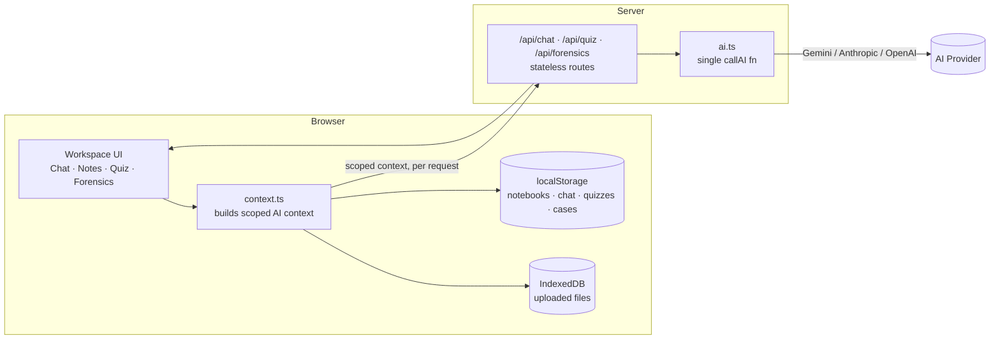

<div align="center">

# 🧵 Noteloom

**A hierarchical notebook system with an AI tutor woven into every chapter — and an error-autopsy engine that won't give you the answer until it understands your mistake.**

[](#-quickstart)
[](#-configuration)
[](#-data-model)
[](#-known-limitations)

[Quickstart](#-quickstart) · [Signature Feature](#-misconception-forensics) · [Architecture](#-architecture) · [Structure](#-project-structure) · [Roadmap](#-roadmap)

</div>

---

## ✨ Why Noteloom

Most study tools either dump an answer key on you or chat generically about a subject with no memory of what you're actually working through. Noteloom does two things differently:

- **Everything is scoped.** Every notebook has sub-notebooks, and every sub-notebook is its own sealed workspace — its own tutor chat, its own uploaded notes, its own quiz, its own case history. The AI never sees more context than the chapter you're sitting in.
- **Wrong answers get investigated, not corrected.** The flagship feature, **Misconception Forensics**, treats a wrong answer like a case file: it reconstructs *how* you likely got there, names the misconception, and only unseals the correct explanation after you've engaged with diagnostic questions.

```
Notebook (e.g. "Physics")
 └─ Sub-notebook (e.g. "Chapter 1 – Kinematics")     ← the actual workspace
     ├─ 💬 Chat with a tutor scoped only to this sub-notebook
     ├─ 📎 Uploaded notes (PDF / image / text)
     ├─ 🧪 AI-generated quiz
     ├─ 🔍 Misconception Forensics ("Case Files")
     └─ ▶️  Saved videos
```

---

## 🚀 Quickstart

```bash
npm install
cp .env.example .env.local
npm run dev
```

Open **http://localhost:3000**. No database, no auth setup, no cloud project to provision — notebooks, chat, quizzes, and forensics cases persist straight to `localStorage`, and uploaded files persist to `IndexedDB`. The only network calls at runtime go to your chosen AI provider.

> **First run note:** building/dev needs one moment of internet access to fetch the Google Fonts used in the design (Inter, Source Serif 4, IBM Plex Mono). Fully offline environment? Swap `app/layout.tsx` to system fonts.

### Configuration

Edit `.env.local`:

```bash
# "gemini" (default), "anthropic", or "openai" — switch providers with this one line
AI_PROVIDER=gemini

GEMINI_API_KEY=...          # free key: https://aistudio.google.com/apikey
GEMINI_MODEL=gemini-2.5-flash

# only needed if AI_PROVIDER=anthropic
ANTHROPIC_API_KEY=sk-ant-...
ANTHROPIC_MODEL=claude-sonnet-4-6

# only needed if AI_PROVIDER=openai
OPENAI_API_KEY=sk-...
OPENAI_MODEL=gpt-4o
```

---

## 🏗️ Architecture



| Layer | Where | Notes |
|---|---|---|
| Notebooks / Sub-notebooks / Chat / Quizzes / Forensics cases | `lib/storage.ts` (`localStorage`) | Every function already returns a `Promise`, so swapping in a real backend later (e.g. Supabase) touches this one file — no component changes needed. |
| Uploaded files | `lib/files-db.ts` (`IndexedDB` via `idb`) | Kept separate from localStorage since images/PDFs can be a few MB. |
| AI provider | `lib/ai.ts` | One `callAI()` function, no SDK — plain `fetch`. Defaults to Gemini 2.5 Flash. |
| System prompts | `lib/prompts.ts` | Tutor prompt + the 3-phase Forensics prompts + quiz prompt. |
| "AI memory" scoping | `lib/context.ts` | Builds the notes/chat context string sent with every request, from *only* that sub-notebook's files + messages. |
| API routes | `app/api/{chat,forensics,quiz}/route.ts` | Stateless — the client sends the scoped context on every call. |

**Why localStorage instead of a hosted database for the MVP:** the goal is handing someone a link (or a zip) and having it working in under a minute — no project, schema, or access policies to set up first. The data layer is deliberately isolated behind `lib/storage.ts` and `lib/files-db.ts` so a production swap is a matter of reimplementing two files, not rewriting the UI.

---

## 🔍 Misconception Forensics

This is the feature the whole app is built around — and it's enforced by application logic, not just a prompt asked nicely to behave:

| Phase | What happens |
|---|---|
| **1. Analyze**<br›`POST /api/forensics {phase: "analyze"}` | The model reconstructs the reasoning chain, names the root misconception, builds a "Your Path" vs. "Correct Path" comparison, and writes 2–3 diagnostic questions. The prompt explicitly forbids stating the final answer here — and the JSON schema returned simply *has no field* for a full explanation yet, so there's nothing to leak. |
| **2. Diagnose**<br›entirely client-side | Diagnostic answers came back with the analysis, so feedback is instant. The **"Unseal full case report"** button renders as a locked stamp and stays disabled until every question is answered. |
| **3. Reveal**<br›`POST /api/forensics {phase: "reveal"}` | Only ever called after the gate opens. A separate model call with its own prompt — the full explanation genuinely does not exist anywhere client-side until this point. |

Every case is saved per sub-notebook (`lib/hooks/use-forensics.ts`), and a short note is logged into the chat history when a case is opened — so ordinary tutor chat carries continuity too ("earlier you ran Forensics on a sign error in projectile motion...").

---

## ▶️ Saved Videos

Each sub-notebook has a **Videos** tab for keeping YouTube resources next to the notes:

- Paste any YouTube URL (including `youtu.be` and Shorts) and it's saved with a thumbnail, title, and channel — pulled via YouTube's public oEmbed endpoint, no API key needed.
- Click a thumbnail to play inline without leaving the workspace.
- A **"Find videos on YouTube"** button opens a search pre-filled with the sub-notebook's own title.
- Saved titles and notes feed into the tutor/quiz/Forensics context (so the AI can reference "the video you saved on X") — but never the video content itself; nothing gets transcribed.

Implementation: `lib/youtube.ts` (URL parsing + oEmbed), `lib/hooks/use-videos.ts`, `components/video-panel.tsx`, persisted via `storage.ts` under its own key per sub-notebook.

---

## 🎨 Design Language

The name is the concept: **Noteloom** = notes + weaving threads together.

- Notebooks render as spined covers on the dashboard.
- The tutor uses a **thread-blue** accent throughout.
- Misconception Forensics is styled as an investigation **case file**: reasoning reconstructed on a pinned timeline, a two-column exhibit comparison (your path vs. the correct path), and a report that's visibly **sealed** until diagnostics are answered — then **unseals** with a small flip animation.

| Role | Color |
|---|---|
| Base | Ink navy / warm paper |
| Primary | Thread blue |
| Forensics / evidence accent | Manila gold |
| Misconception flag | Brick red |
| Correct / success | Moss green |

**Type:** Source Serif 4 (headings) · Inter (UI) · IBM Plex Mono (case-file labels — `CASE FILE`, `EXHIBIT A`).

---

## 📁 Project Structure

```
app/
  page.tsx                                 Dashboard — notebooks grid
  notebook/[notebookId]/page.tsx           Sub-notebooks list
  notebook/[notebookId]/sub/[subId]/page.tsx   The workspace (Chat / Notes / Quiz / Forensics tabs)
  api/chat/route.ts
  api/forensics/route.ts
  api/quiz/route.ts
  globals.css                              Design tokens (light + dark)
components/
  ui/                                      Small shadcn-style primitives (button, dialog, tabs, ...)
  chat-panel.tsx
  forensics-panel.tsx                      The Case File board — the signature feature
  quiz-panel.tsx
  file-upload.tsx
  notebook-card.tsx / sub-notebook-card.tsx
lib/
  types.ts                                 Data model
  storage.ts                               localStorage persistence
  files-db.ts                              IndexedDB persistence for files
  ai.ts                                    Gemini / Anthropic / OpenAI switch
  prompts.ts                               All system prompts
  context.ts                               Builds the scoped "AI memory" context
  hooks/                                   One hook per data type
```

---

## ⚠️ Known Limitations

Being upfront about these at a hackathon demo beats getting caught off guard by a question:

- **Auth:** none — single-user local app. Add real auth + swap the storage layer for a production version.
- **PDF text extraction** (`lib/pdf.ts`) is best-effort, client-side (`pdfjs-dist`). Text-based PDFs extract cleanly; scanned/image-only PDFs won't produce text (the file still uploads, and the tutor is told plainly it couldn't read that one).
- **Diagnostic grading** happens client-side, since the correct answer indices are needed immediately for instant feedback. Fine for self-study; a graded-assessment product would need this moved server-side.
- **No streaming:** chat responses return as a single completion, not token-by-token. Straightforward to add with `stream: true` on either provider.
- **No collaborative / multi-device sync:** everything lives in one browser. That's the tradeoff for the zero-backend setup.

## 🗺️ Roadmap

- [ ] Swap `storage.ts` / `files-db.ts` for a hosted backend + real auth
- [ ] Stream chat responses token-by-token
- [ ] Server-side diagnostic grading for graded-assessment use cases
- [ ] Optional cloud sync across devices

---

<div align="center">

Built for a hackathon in one weekend — zero backend, one config line to switch AI providers, and a signature feature that makes you earn the answer.

</div>